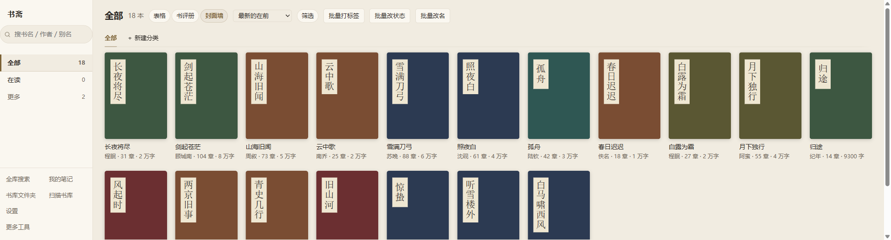
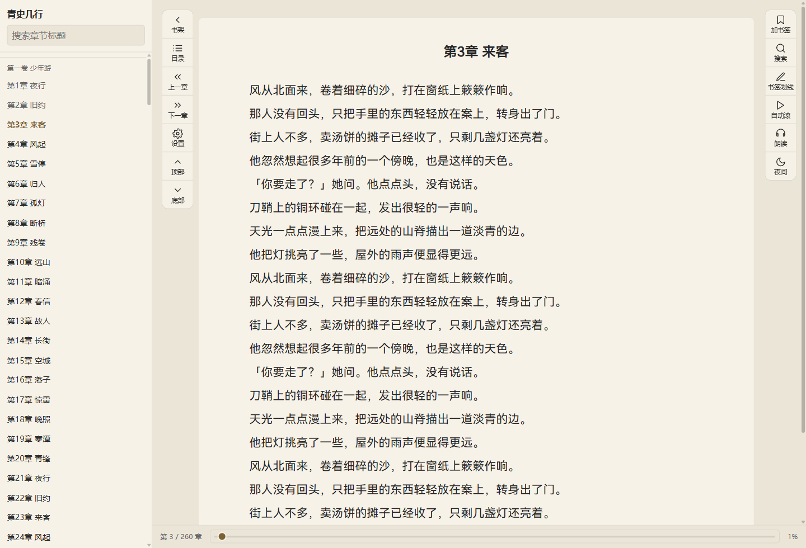

# 书斋

> 你的文件夹，就是你的书斋：txt 小说自动配封面、切目录、记得你读到哪

[](LICENSE) [](https://github.com/rockbenben/365opensource)

[**⬇ 下载**](https://github.com/rockbenben/shuzhai/releases/latest) · Windows 安装包 / 免安装绿色版



电脑里堆了几百上千个 txt 小说，文件名乱七八糟、没有封面、双击开是一整块。书斋扫一遍那个文件夹，把它们摆成带封面的书架，切出目录，记住你读到哪一章第几段。

和常见的几种东西不一样：Calibre 会把书**拷进它自己的库**再转格式，「阅读」这类靠**书源**在线找书，微信读书起点这些书在**别人服务器**上。书斋只认你硬盘上那个文件夹。

> [!TIP]
> **书一直在你自己的文件夹里。** 不导入、不拷贝、不上传，不用注册，不联网也能完整使用。**正文永远只读**——切目录、净化、繁简都是打开时套规则，一个字都不写回你的 txt。
>
> 会动到磁盘的只有**改文件名**和**删重复文件**：你自己点、有预览、能撤销，删掉的进系统回收站（网络盘上没有回收站，那时会另问你一次，改放进应用自己的暂存区）。**两条路都拿得回来，都不是真删。**

## 支持范围

| 方面 | 支持情况 |
|---|---|
| 系统 | **Windows 10 及以上，64 位**（安装版 / 免安装绿色版）。32 位和 Win 8.1 跑不了——这是 Electron 的底线，不是没做 |
| 能在应用里读 | `.txt` `.md` / `.markdown`（阅读器）、`.pdf` `.epub`（内置查看器，划线、笔记、朗读、书内搜索都有） |
| 只收进书架、点开交给系统程序 | `.mobi` `.azw3` `.azw` `.prc` `.pdb` `.fb2` `.fbz` `.umd` `.cbz` `.cbr` `.djvu` |
| 编码 | UTF-8 / GB18030（含 GBK）/ Big5 / UTF-16，自动认，认错了能手动改 |
| 联网 | **不联网也能完整使用**。三处会联网，都得你自己点：找封面、查在线地址死链、朗读时选了在线音色（**正文会一段段发给第三方**；默认是系统语音，不联网）|
| 账号 | 不需要 |

## 能做什么

- **摆成书架**：扫一个或多个文件夹，从文件名认出书名作者，联网找封面（可关）。八千本也铺得动。
- **切出目录**：自动识别章节标题。切不出来的那几本，它会翻一遍正文、看出这本书的标题是怎么写的，让你挑一条应用。
- **读起来**：10 张纸色、滚动 / 翻页、书内搜索、繁简随时切、朗读（默认系统语音，离线）。进度精确到章内段落，PDF 自己没有目录还能手动建一个。
- **记下来**：读完打个分、写一句话——下次不用再想「这本我看过没」。划线四色、每色代表什么你自己定，扫描版 PDF 选不中字的直接在页上框一块；侧栏「我的笔记」把全库的笔记摆在一起，能搜、能归组、导成 markdown。
- **回头找**：三种看法各答一个问题——封面墙认封面、表格一屏看全账目、书评册只读你写的那句话；文件夹 / 评分 / 标签 / 阅读状态 / 哪年读完的还能组合着筛。
- **批量整理**：打标签和改阅读状态**作用于整个搜索结果**（搜「重生」一次全标上，做完能撤）；另有查重复和多版本、按模板改文件名、导出 EPUB / TXT / 表格、备份恢复。



两级目录（卷 / 章）、左右两条工具轨、底下是「第 N / 共 M 章」。

## 快速开始

下载装完打开，第一次是空的：点「选一个文件夹」指向你放小说的目录，扫完就摆出来了。想先试试不装的，用免安装绿色版，解压就能跑。

## 已知限制

- **只有 Windows 打过包**。代码没有平台相关的东西，但 mac / Linux 的安装包没做过、也没验过。
- **安装包没有代码签名**：第一次运行 Windows SmartScreen 会拦一下（「未知发布者」），点「更多信息 → 仍要运行」就行；证书一年好几百，这个项目先不买。不想凭信任点这一下，就[自己构建一份](#自己构建)。
- **全文搜索只管纯文本书**：`.txt` / `.md` 建 FTS5 索引，全库搜正文；PDF / EPUB 要打开那本书在查看器里搜，不进全库索引。章节规则、正文净化、繁简转换同理，都建立在「按字节偏移定点读 + 章节索引」上。
- **极少数书切不出目录**：实测自己那八千多本纯文本，只有三十来本切出一整章（多半是短篇，或者标题格式太特殊），在「章节」里手写一条规则就行。
- **不做 AI**：摘要、前情回顾、人物关系、自动打标签一律不实现。

## 自己构建

需要 Node 24+（`.ts` 原生剥类型和 `node:sqlite` 都靠它，主进程因此没有构建步骤）。

```bash
npm install
npx install-electron          # 这一步不能省，见下
npm run dist                  # 出安装包 + 免安装 zip，产物在 release/
npm run build && npm start    # 只想跑起来看看
```

`npm install` **不会**帮你下 Electron 的运行时——从 Electron 42 起那个包不再有 `postinstall`，改成暴露一个显式的 `install-electron`。少了这一步，`npm run dist` 会报 `The specified electronDist does not exist`，`npm start` 也起不来。判断到没到位：看有没有 `node_modules/electron/dist/`。

## 许可

代码 MIT，见 [LICENSE](LICENSE)。

随应用发布的正文字体是 **HarmonyOS Sans SC**（只带 Regular 一个字重），按华为的协议随包分发，`LICENSE.txt` 装在 `resources/fonts` 下跟着一起发——那是协议要求的。

## 关于 365 开源计划

[365 开源计划](https://github.com/rockbenben/365opensource) 的第 **#036** 个项目——一个人 + AI，一年 300+ 个开源项目。

[提交你的需求 →](https://365.aishort.top/) · [Discord](https://discord.gg/PZTQfJ4GjX) · [Telegram](https://t.me/aishort_top)
